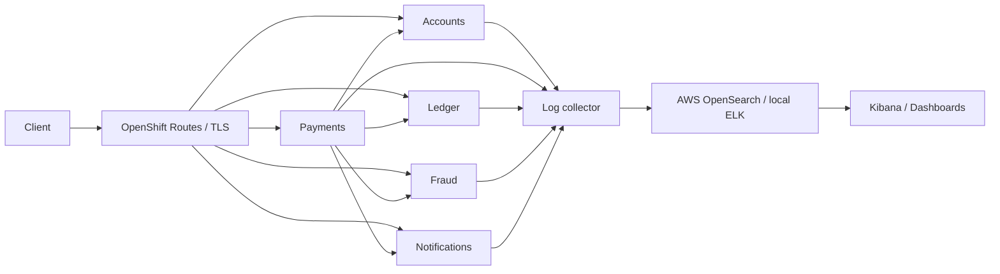
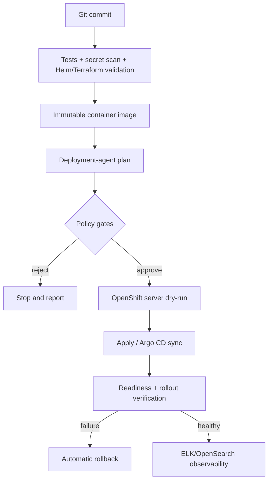

# Architecture

## Design boundaries

- All data is synthetic. The sample is not suitable for processing real financial information.
- Services run independently and communicate through HTTP in the demo.
- Local mode uses Docker Compose and optional ELK.
- Cloud mode uses AWS infrastructure, ROSA (managed OpenShift), Helm, and OpenShift GitOps.
- The AI reviews a bounded JSON plan; deterministic policy remains authoritative.
- Production uses a GitHub protected environment, explicit approval, immutable images, dry-run, rollout checks, and rollback.
